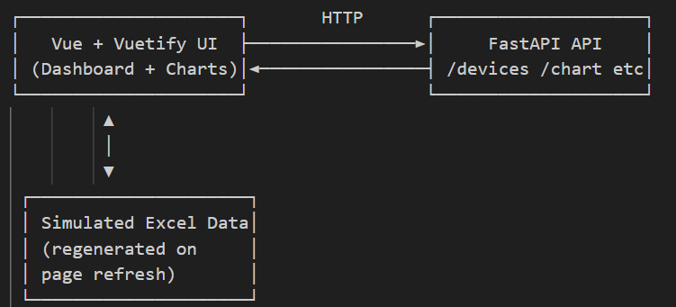

# IoT Device Monitoring Dashboard

This project is a full-stack IoT dashboard that simulates and displays real-time data from multiple industrial devices. It allows users to monitor temperature, vibration, sound, and power and many more data through interactive charts and device management interfaces. It can be used to identify anomalies, detect errors and set alerts or notifications in future deployment.

---

# Github Link

https://github.com/Willowtea1/IoT-Device-Monitoring-Dashboard

---

## Tech Stack

- Backend: FastAPI (Python)
- Frontend: Vue 3 + Vuetify
- Charting: Chart.js (via vue-chartjs)
- Data Storage: Simulated data saved to `.xlsx` with Pandas
- Visualization: Responsive UI with Vuetify components

---

## Setup Instructions

### 1. Backend (FastAPI)

```bash
# Navigate to the project root directory (e.g., IoT-Device-Monitoring-Dashboard)
cd IoT-Device-Monitoring-Dashboard

# Create a virtual environment
python -m venv .venv

# Activate the virtual environment (Windows)
.venv\Scripts\Activate

# Navigate to the backend directory
cd backend

# Install Python dependencies
pip install -r requirements.txt

# Start the FastAPI development server
uvicorn main:app --reload

```

### 2. Frontend (Vuetify)

```bash
# Open a new terminal (Ctrl + Shift + `)

# Navigate to the project root directory (e.g., IoT-Device-Monitoring-Dashboard)
cd IoT-Device-Monitoring-Dashboard

# Navigate to frontend directory
cd frontend

# Install dependencies
npm install

# Start the development server
npm run dev

```

---

## Screenshot


## Future Improvements

To expand this system, I would integrate real-time updates using WebSockets such as FastAPI's WebSocket support to push live sensors data from the machines to the frontend without requiring manual refreshes. This would make the dashboard more responsive and suitable for time-critical applications. Additionally, implementing user authentication and role-based access would allow secure multi-user support for enterprise environments. Alerting mechanisms such as through email, SMS, or in-app notifications could be added to flag abnormal device readings in real time. Lastly, integrating a database like PostgreSQL for persistent storage would enable historical data analysis and reporting.

---

## System Design Overview

The IoT Device Monitoring Dashboard is a full-stack client-server application designed to simulate, store, and visualize IoT sensor data. Image below is the architecture in a diagram.



### Backend (FastAPI)

- Role: Provides API endpoints and simulates device data.

- Data Handling: Simulated sensor data (temperature, vibration, sound, power) is generated using Python and stored in an Excel .xlsx file via Pandas and OpenPyXL.

- API: RESTful endpoints serve real-time device data and summary statistics.

- Framework Choice: FastAPI is selected for its asynchronous capabilities, performance, and automatic API documentation.

  #### API Endpoints

  ##### GET /api/devices

  Description:
  Returns a list of all available devices with their basic information and current simulated sensor data.

  Behavior:
  Calls generate_device_data() to simulate or retrieve the current status and readings of devices.
  Accepts optional simulate=true query to regenerate data.

  Response:
  A list of device objects containing ID, type, status, temperature, vibration, sound, and power values.

  #### GET /api/devices/{device_id}

  Description:
  Retrieves detailed information and historical data for a specific device.

  Behavior:
  Calls generate_device_data() to get current data.

  Matches the device by device_id.
  Uses get_device_history() to include historical sensor data.

  Response:
  A detailed object containing device metadata, live sensor values, and historical readings.

  #### GET /api/summary

  Description:
  Returns high-level dashboard statistics about all devices.

  Behavior:
  Simulates device data using generate_device_data().
  Calculates total number of online/offline devices and the average temperature.
  Selects the first device as a featured sample.

  Response:
  An object with summary statistics:
  online, offline, avg_temp, and featured_device.

  ##### GET /api/devices/{device_id}/chart

  Description:
  Returns time-series sensor data for the selected device, used for chart visualization.

  Behavior:
  Calls simulate_data() on every request to ensure up-to-date Excel data.
  Loads simulated_iot_data.xlsx and filters entries matching the given device_id.

  Response:
  A list of timestamped sensor readings (e.g., temperature, vibration, sound, power) for the selected device.

### Frontend (Vue 3 + Vuetify)

- Role: Displays a responsive dashboard with charts, filters, and device detail views.

- UI: Built with Vuetify's material design components including layout grids, dropdowns, cards, and data tables.

- Charts: Integrated with Chart.js using vue-chartjs for visualizing sensor data trends.

- State Management: Uses Vue 3's Composition API for reactive state and clean logic separation.

- Routing: Managed by Vue Router to handle navigation between dashboard sections.

### Communication Flow

- The frontend sends HTTP requests to FastAPI endpoints to retrieve device data and statistics.

- Data updates dynamically based on user interaction (e.g. dropdown selections or refresh), triggering UI updates.

- Design Decisions
  Excel-based storage: Chosen for simplicity and ease of use in simulated or prototyping scenarios.

- Separation of concerns: The backend and frontend are decoupled for better maintainability and scalability.

- Modern development stack: FastAPI and Vue 3 offer a productive, modular foundation for building scalable full-stack applications.
