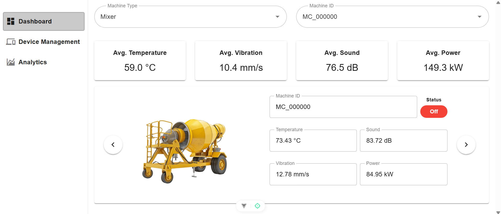
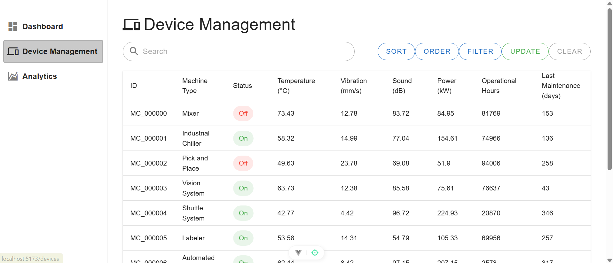
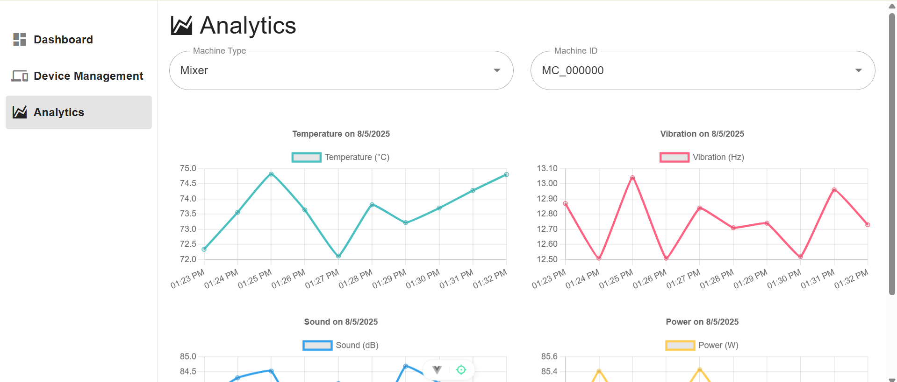

# IoT Device Monitoring Dashboard

This project is a full-stack IoT dashboard that simulates and displays real-time data from multiple industrial devices. It allows users to monitor temperature, vibration, sound, and power and many more data through interactive charts and device management interfaces.

---

# Github Link

https://github.com/Willowtea1/Device-Monitoring-Dashboard

---

## Tech Stack

- Backend: FastAPI (Python)
- Frontend: Vue 3 + Vuetify
- Charting: Chart.js (via vue-chartjs)
- Data Storage: Simulated data saved to `.xlsx` with Pandas
- Visualization: Responsive UI with Vuetify components

---

## Setup Instructions

### 1. Backend (FastAPI)

```bash
# Navigate to home directory, ensure you are in
../Monitor

# Navigate to backend directory
cd backend

# Create and activate virtual environment
python -m venv venv
source venv/Scripts/activate

# Install dependencies
pip install -r requirements.txt

# Run the FastAPI server
uvicorn main:app --reload

```

### 2. Frontend (Vuetify)

```bash
# Navigate to frontend directory
cd frontend

# Install dependencies
npm install

# Start the development server
npm run dev

```

---

## Screenshot







## Future Improvements

To expand this system, I would integrate real-time updates using WebSockets such as FastAPI's WebSocket support to push live sensors data from the machines to the frontend without requiring manual refreshes. This would make the dashboard more responsive and suitable for time-critical applications. Additionally, implementing user authentication and role-based access would allow secure multi-user support for enterprise environments. Alerting mechanisms such as through email, SMS, or in-app notifications could be added to flag abnormal device readings in real time. Lastly, integrating a database like PostgreSQL for persistent storage would enable historical data analysis and reporting.
